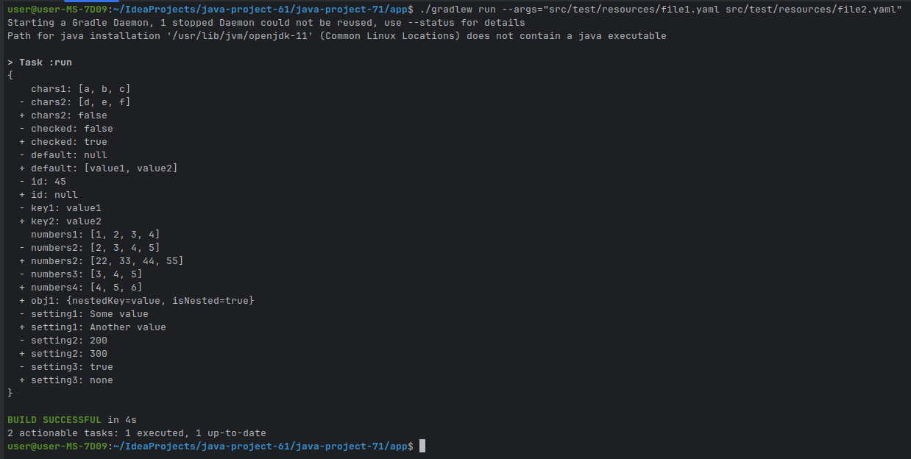
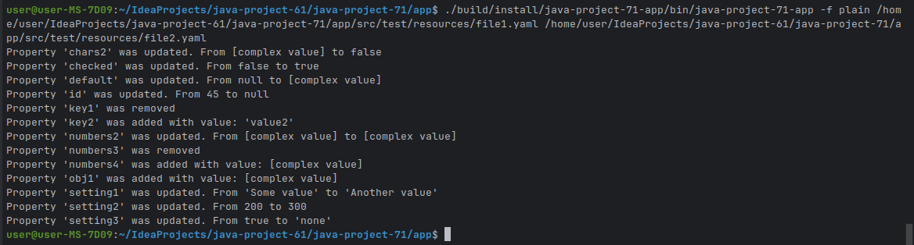

### Hexlet tests and linter status:

Консольная утилита `gendiff`, сравнивающая содержимое двух текстовых файлов (информацию об обмене данными). Поддерживаются два формата сравниваемых файлов: `Json` и `Yaml`.

# Справка
gendiff -h
gendiff --help

# Версия
gendiff -V
gendiff --version

# Сравнение файлов
gendiff file1.json file2.json
gendiff --format=plain file1.yml file2.yml
gendiff -f json file1.json file2.json

### Пример вывода справки:

### Пример сравнения Yaml-файлов:

### Пример сравнения вложенных структур:

### Пример сравнения вложенных структур в формате plain:
